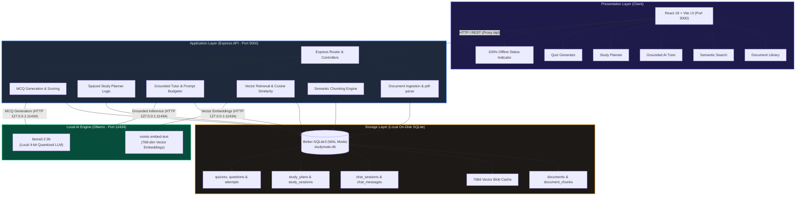

# StudyMate Offline 🎓

> **A privacy-first, locally runnable AI study companion for students.**  
> Grounded document Q&A with source citations, semantic vector search, practice quiz generation, and adaptive study planning powered entirely by local open-source models (Ollama).  
> **100% offline. Zero cloud data transmission. Zero subscription fees.**

[](LICENSE)
[](https://www.typescriptlang.org/)
[](https://react.dev/)
[](https://ollama.com/)
[](https://www.sqlite.org/)
[](https://hacktoberfest.com/)
[](scripts/audit_workflows.cjs)

---

## 📑 Table of Contents

1. [Problem Statement](#-problem-statement)
2. [Solution & Target Users](#-solution--target-users)
3. [Key Features](#-key-features)
4. [Technology Stack](#-technology-stack)
5. [Architecture Overview & Mermaid Diagram](#-architecture-overview--mermaid-diagram)
6. [How Local AI & Offline Functionality Work](#-how-local-ai--offline-functionality-work)
7. [Supported Document Formats](#-supported-document-formats)
8. [Prerequisites & System Requirements](#-prerequisites--system-requirements)
9. [Fresh Local Setup & Installation Commands](#-fresh-local-setup--installation-commands)
10. [How to Run Frontend, Backend, and Ollama](#-how-to-run-frontend-backend-and-ollama)
11. [Automated Verification & Testing](#-automated-verification--testing)
12. [Privacy Guarantees & Technical Limitations](#-privacy-guarantees--technical-limitations)
13. [Deployment Feasibility Assessment](#-deployment-feasibility-assessment)
14. [Hackathon Judging & Demonstration Resources](#-hackathon-judging--demonstration-resources)
15. [License](#-license)

---

## 🚨 Problem Statement

Modern students and researchers rely heavily on digital learning aids, but current AI study assistants suffer from severe structural flaws:

1. **Academic Surveillance & Privacy Insecurity:** Commercial cloud LLMs retain, inspect, and train on uploaded user documents. Students uploading proprietary lecture slides, unpublished thesis drafts, or graded assignments risk academic integrity breaches and intellectual property loss.
2. **The "Wi-Fi Cliff" & Inequity:** Cloud tools become instantly useless during campus Wi-Fi outages, in library basements, on flights, or in underserved regions with unstable connectivity.
3. **Hallucination Without Accountability:** Generic cloud chatbots invent plausible-sounding equations, fake dates, and non-existent textbook citations with false confidence, misleading students during high-stakes exam preparation.
4. **Subscription Paywalls:** Mainstream AI platforms lock advanced reasoning and document uploads behind \$20–\$40/month subscriptions, pricing out students globally.

---

## 💡 Solution & Target Users

### The Solution
**StudyMate Offline** is a desktop-first, fully private AI study platform. It replaces third-party cloud infrastructure with efficient, quantized open-source models running locally on the student's personal computer via [Ollama](https://ollama.com). Every document extraction, vector embedding, similarity search, and conversational response runs strictly in-memory and on-device.

### Target Users
* **University & High-School Students:** Preparing for midterms and finals from course syllabi, lecture slides, and reading packets.
* **Graduate Researchers & Academics:** Querying sensitive, unpublished drafts and literature reviews without data leaks.
* **Commuters & Offline Learners:** Studying on planes, trains, or in locations with no internet access.
* **Privacy-Conscious Learners:** Anyone who demands absolute ownership of their learning data with zero recurring fees.

---

## 🌟 Key Features

| Feature | Description |
|---|---|
| 🔒 **100% Offline & Private** | Zero telemetry, zero cloud API requests, and zero tracking. All files, vector embeddings, and chats remain on your local machine. |
| 📄 **Document Ingestion & Chunking** | Ingests PDF and TXT course materials. Extracts text, computes page boundaries, and produces semantic overlapping chunks (500–1000 chars with 100–150 char overlap). |
| 🔍 **Local Semantic Vector Search** | Embeds text using local `nomic-embed-text` (768 dimensions) and executes in-memory cosine similarity search directly against SQLite. Returns exact document names, page numbers, chunk indices, and similarity scores. |
| 🤖 **Grounded AI Tutor with Citations** | Answers questions strictly using retrieved excerpts. Emits clickable `[Source 1]` citations linked to exact passages and refuses unsupported queries honestly (`insufficientEvidence: true`). |
| ⚙️ **Configurable Explanation Modes** | Choose between **Standard** (balanced conceptual breakdown), **Concise** (rapid revision bullet points), and **Simple Analogies** (intuitive real-world metaphors). |
| 📝 **Practice Quiz Generator** | Generates 4-option multiple-choice questions (MCQs) rooted in your notes with real-time grading, score tracking, and contextual rationales. |
| 📅 **Adaptive Study Planner** | Generates prioritized day-by-day revision timetables based on target exam dates, daily available hours, and difficult topics with interactive completion tracking. |
| ⚡ **Laptop-CPU Optimized** | Context budgeting (top-3 excerpt filtering, adaptive generation token limits: 256–512) and a 300-second timeout guardrail allow smooth execution on standard laptops without discrete GPUs. |

---

## 💻 Technology Stack

* **Frontend:** React 18, TypeScript 5.7, Vite 6, Tailwind CSS, Lucide React
* **Backend:** Node.js (v18–v24), Express 4, TypeScript, Better-SQLite3, Multer, `pdf-parse`
* **Local AI Inference Engine:** [Ollama](https://ollama.com) (v0.35+)
  * `llama3.2:3b` (Meta's lightweight instruction-tuned 3B LLM, 4-bit quantized, ~2.0 GB)
  * `nomic-embed-text` (Nomic AI's 768-dimensional embedding model, ~274 MB)
* **Storage Layer:** SQLite3 in Write-Ahead Logging (WAL) mode with serialized BLOB vector storage
* **Monorepo Architecture:** npm Workspaces (`client`, `server`, `shared`)

---

## 🏛️ Architecture Overview & Mermaid Diagram

StudyMate Offline operates through an on-device three-tier architecture: the React frontend client, the Express TypeScript API server with SQLite persistence, and the Ollama local inference daemon.



---

## 🧠 How Local AI & Offline Functionality Work

The entire RAG (Retrieval-Augmented Generation) pipeline runs locally without external dependencies:

```
[Document Upload] ──> [Text Extraction] ──> [Semantic Chunking]
                                                    │
                                                    ▼
[User Query] ──> [Local Embedding] ──> [Local Nomic Embed (768d)]
      │                  │                          │
      │                  ▼                          ▼
      │         [Cosine Similarity] ──> [SQLite Vector Blob Cache]
      │                  │
      ▼                  ▼
[Context Budgeting] ──> [Prompt Assembly (Strict Citations)]
                                │
                                ▼
                     [Local Llama 3.2:3b Engine]
                                │
                                ▼
            [Grounded Answer + [Source N] Citations]
```

1. **Ingestion & Text Extraction:** When a document (`.pdf` or `.txt`) is uploaded, `pdf-parse` extracts text and records character offsets and page markers.
2. **Chunking with Overlap:** Text is split into chunks of 500–1000 characters with 100–150 characters of overlap to maintain semantic continuity across boundaries.
3. **On-Device Embedding:** Each chunk is dispatched to `http://127.0.0.1:11434/api/embeddings` using `nomic-embed-text`, returning a 768-dimensional float array. Vectors are serialized into raw binary BLOBs and stored in SQLite.
4. **Local Vector Search:** When a user searches or asks a question, the query is embedded via the same local model. The server computes cosine similarity scores across candidate vectors in memory.
5. **Context Budgeting:** The top-$k$ relevant chunks (filtered by threshold) are formatted into a strict context block. Low-priority noise is trimmed to prevent context-window overflow on low-resource machines.
6. **Grounded Prompt Construction:** The prompt explicitly instructs Llama 3.2:
   > *"Answer the question strictly and solely based on the provided document excerpts. Include source citations formatted as [Source N]. If the context lacks sufficient evidence, state clearly that you cannot answer based on the notes."*
7. **Inference & Citation Extraction:** `llama3.2:3b` generates the grounded response. The server maps `[Source N]` tags back to document filenames, page numbers, and snippet previews for user verification.
8. **Honest Refusal Handling:** If no chunks meet the similarity threshold or if the model indicates missing evidence, the system returns `insufficientEvidence: true`, preventing hallucinations.

---

## 📁 Supported Document Formats

* **Portable Document Format (`.pdf`):** Standard course lecture notes, academic papers, slides exported to PDF, and syllabus handouts. *Note: PDF files must contain digital text. Scanned image-only PDFs require pre-OCR processing.*
* **Plain Text (`.txt`):** Markdown files, lecture summaries, transcriptions, and raw note files.
* **Maximum File Size:** Configurable up to 25 MB per document (default: `MAX_FILE_SIZE_MB=25`).

---

## 📋 Prerequisites & System Requirements

### Hardware Requirements
* **Processor:** Dual-core or quad-core x86_64 CPU (Intel Core i5/i7 or AMD Ryzen) or Apple Silicon (M1/M2/M3/M4).
* **Memory (RAM):** 8 GB minimum (16 GB recommended).
* **Storage:** ~4 GB available disk space (Ollama models: ~2.3 GB total).
* **Graphics (GPU):** Optional. Fully optimized for CPU-only execution.

### Software Prerequisites
1. **Node.js:** v18.0.0 or higher ([nodejs.org](https://nodejs.org))
2. **npm:** v9.0.0 or higher
3. **Ollama:** Installed from [ollama.com](https://ollama.com)

---

## 🚀 Fresh Local Setup & Installation Commands

Follow these exact commands to set up StudyMate Offline from scratch:

### 1. Clone the Repository
```bash
git clone https://github.com/YOUR_USERNAME/studymate-offline.git
cd studymate-offline
```

### 2. Install Dependencies
```bash
npm install
```
*(This installs root, client, server, and shared workspace dependencies).*

### 3. Pull Required Local AI Models
Ensure the Ollama daemon is active (`ollama serve`), then download the two required lightweight models:
```bash
# Language Model for Q&A, Quizzes, and Planner (~2.0 GB)
ollama pull llama3.2:3b

# Embedding Model for Vector Search (~274 MB)
ollama pull nomic-embed-text
```
*Verify models exist:*
```bash
ollama list
```
Both `llama3.2:3b` and `nomic-embed-text:latest` should appear in the output.

### 4. Create Environment Configuration File
Copy the provided safe `.env.example` template to `server/.env`:

**Windows PowerShell:**
```powershell
Copy-Item server/.env.example server/.env
```

**Linux / macOS:**
```bash
cp server/.env.example server/.env
```

The default configuration is pre-calibrated for CPU-safe local inference:
```env
PORT=5000
NODE_ENV=development
DATABASE_PATH=./data/studymate.db
UPLOAD_DIR=./uploads
MAX_FILE_SIZE_MB=25

# Local Ollama Configuration
OLLAMA_BASE_URL=http://127.0.0.1:11434
OLLAMA_LLM_MODEL=llama3.2:3b
OLLAMA_EMBED_MODEL=nomic-embed-text
OLLAMA_TIMEOUT_MS=300000
OLLAMA_MAX_TOKENS=512
```

---

## 🏃 How to Run Frontend, Backend, and Ollama

Start all three services across separate terminal windows:

### Terminal 1: Start Ollama Daemon
```bash
ollama serve
```
*(If Ollama is already running as a system service or tray app on Windows/macOS, this step can be skipped).*

### Terminal 2: Start Backend API Server
```bash
npm run dev:server
```
*Output:*
```
StudyMate Offline Server running
Port:          5000
Health API:    http://localhost:5000/api/health
Documents API: http://localhost:5000/api/documents
```

### Terminal 3: Start Frontend Client
```bash
npm run dev:client
```
*Output:*
```
VITE v6.4.3 ready in 350 ms
Local: http://localhost:3000/
```

Open your browser to: **[http://localhost:3000](http://localhost:3000)**.

---

## 🧪 Automated Verification & Testing

StudyMate Offline provides comprehensive automated test suites to verify system health:

### 1. 10-Point End-to-End System Audit
Run the automated end-to-end verification script:
```bash
npm run audit
```
*What it tests live:* Server launch, document upload, text extraction, 768-d embedding generation, semantic vector search, metadata accuracy, grounded AI tutor response, source citations, honest refusal on out-of-domain queries, study planner, quiz generator, timeout error handling, offline loopback isolation, and git secret protection.

### 2. Milestone Integration Test Suite
```bash
npm test
```
Executes `test-milestone4.cjs` and `test-milestone5.cjs` covering SQLite schema integrity, vector retrieval, grounded Q&A, and quiz evaluation (18/18 tests).

### 3. TypeScript Type Checks & Production Build
```bash
npm run build
```
Compiles both `server` (`tsc`) and `client` (`tsc && vite build`) with zero type errors.

---

## 🔒 Privacy Guarantees & Technical Limitations

### Privacy Guarantees
* **Zero Cloud Network Calls:** All LLM inference and vector operations route to `http://127.0.0.1:11434`. Disconnecting your internet connection does not disrupt any feature.
* **Local Data Storage:** Uploaded files and the SQLite database (`server/data/studymate.db`) remain entirely on the host machine.
* **No Telemetry or Tracking:** The codebase contains zero analytics scripts, advertising tags, or remote reporting beacons.
* **Safe Repository:** `.gitignore` excludes `.env`, `*.db`, and all uploaded documents from Git commits.

### Technical Limitations
* **CPU Inference Latency:** Running a 3-billion-parameter LLM (`llama3.2:3b`) on consumer laptop CPUs typically requires 25–45 seconds per response. A 300-second timeout guardrail (`OLLAMA_TIMEOUT_MS=300000`) and concise token budgets prevent aborts.
* **Text-Only Documents:** PDFs must contain readable text. Scanned image-only PDFs require external OCR before ingestion.
* **Single-User Desktop Architecture:** Designed for personal student use on a single workstation, not as a multi-tenant cloud SaaS with user authentication.
* **Context Window Budget:** Tailored for targeted conceptual queries rather than summarizing entire 500-page textbooks in a single prompt.

---

## ⚖️ Deployment Feasibility Assessment

### ⚠️ Honest Architectural Declaration
> **No public cloud deployment exists, and none is claimed.**  
> StudyMate Offline is intentionally engineered as an **on-device, local edge application**.

### Why a Public SaaS Deployment is Incompatible with This Project:
1. **Ollama Local Daemon Dependency:** The application relies on a local Ollama process running on loopback (`http://127.0.0.1:11434`). Free-tier or serverless platforms (e.g., Vercel, Netlify, Render Free Tier) lack the persistent RAM (8 GB+), GPU hardware, and ~2.5 GB model storage required to host Llama 3.2.
2. **Unsustainable Cloud Compute Costs:** Hosting continuous cloud GPU instances (such as AWS `g4dn.xlarge` or GCP `g2-standard-4`) costs hundreds of dollars per month, contradicting the project's goal of free, zero-cost access for students.
3. **Privacy Inversion:** Hosting on a public shared server would break the core premise: students would once again be transmitting private course notes and research to a remote cloud host.

### Realistic Institutional & Production Deployment Pathways:
* **Option A: Native Desktop Packaging (Recommended):** Bundle the application using **Electron** or **Tauri** with an embedded or auto-installed Ollama binary to distribute a self-contained one-click installer (`.exe` / `.dmg` / `.AppImage`).
* **Option B: University Campus Intranet Server:** Deploy via Docker Compose on an institutional server with NVIDIA GPU passthrough, allowing students in campus computer labs to access the service over local LAN with zero public internet exposure.

---

## 🎯 Hackathon Judging & Demonstration Resources

For hackathon evaluators and judges reviewing this project:

* 📋 **[Judges Reproduction Guide](docs/JUDGES_REPRODUCTION_GUIDE.md):** 5-minute rapid reproduction instructions, verification commands, and manual evaluation checklists.
* 🎬 **[Demo Recording Script & Screenshots](docs/DEMO_SCRIPT.md):** 2.5-minute presentation script with timestamped screen actions, voiceover narration, and a curated list of 8 sanitized screenshots to capture.

---

## 📄 License

This project is licensed under the [MIT License](LICENSE).
